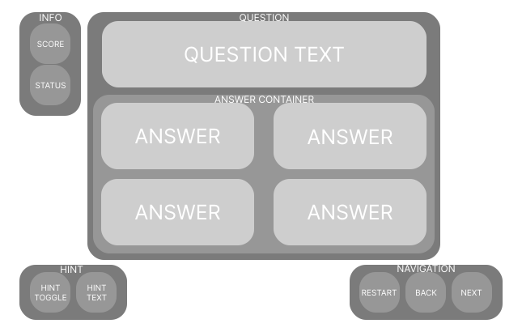

# Quiz Server

## Table of Contents

- [Quiz Server](#quiz-server)
  - [Table of Contents](#table-of-contents)
  - [Badges](#badges)
  - [Tutorials](#tutorials)
    - [Getting Started](#getting-started)
    - [Editing Config](#editing-config)
  - [Data](#data)
    - [Data Table Template](#data-table-template)
  - [Photos](#photos)
  - [Layout](#layout)

## Badges


## Tutorials

### Getting Started

1. Install the [latest version](https://github.com/HoleInOneStudios/Quiz-Server/releases/latest) for your operating system
2. Extract the contents
3. Using your terminal or command prompt, navigate to the extracted folder
4. execute `quiz-app-<version>` within the terminal
   1. Windows &rarr; `.\quiz-app.exe`
   2. Mac &rarr; `.\quiz-app-macos`
   3. Linux &rarr; `.\quiz-app-linux`
5. Navigate the web address provided in the terminal. (e.g. `http://localhost:8080`)

### Editing Config

The configuration is done in the `.env` file. In side it should look like this:

```bash
PORT=80
HOST='localhost'
FILE_PATH='./data.xlsx'
IMAGE_PATH='./img/'
```

`PORT` is the port the server is hosted on. 80 is the default web port.
`HOST` should be changed to the device running the server's public IP address.`

## Data

> Each sheet in a workbook is a different quiz
> [Link to Example](./src/data/data.xlsx)

### Data Table Template

If you don't include text in the answer choice it will not show up, so you can create True or False questions by leaving the other answers blank.

| Question | 1        | 2        | 3        | 4        | Correct        | Hint     | Hint Image                                                                 | Background Image                               |
| -------- | -------- | -------- | -------- | -------- | -------------- | -------- | -------------------------------------------------------------------------- | ---------------------------------------------- |
| *(text)* | *(text)* | *(text)* | *(text)* | *(text)* | *(1, 2, 3, 4)* | *(text)* | *(url of image(Default is random image from `this person doesn't exist`))* | *(url of image(Default is `placeholder.jpg`))* |

## Photos


## Layout


[Figma](https://www.figma.com/file/juw197Ed7Ec5yTbPfFytLu/Quiz-Server?node-id=0%3A1)
