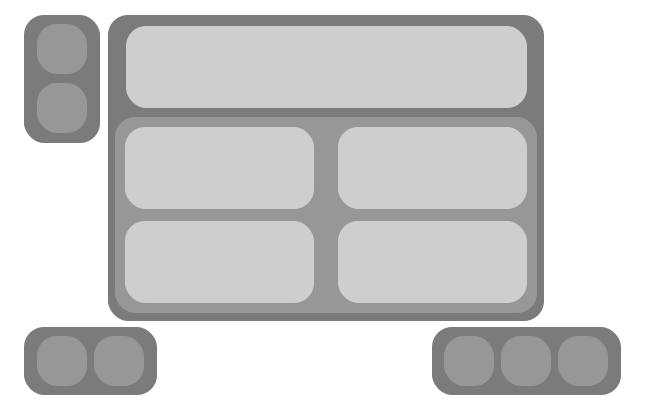

#     Quiz Server

 
           
    

## Layout

### Custom Elements

| Element Name            |
| ----------------------- |
| `quiz-next`             |
| `quiz-back`             |
| `quiz-restart`          |
| `quiz-container`        |
| `quiz-question`         |
| `quiz-question-text`    |
| `quiz-answer-container` |
| `quiz-answer`           |
| `quiz-info`             |
| `quiz-score`            |
| `quiz-status`           |
| `quiz-hint`             |
| `quiz-hint-toggle`      |
| `quiz-hint-text`        |

## Data

> Each sheet in a workbook is a different quiz
> [Link to Example](./src/data/data.xlsx)

### Sheet Table Template

| Question | 1   | 2   | 3   | 4   | Correct | Hint | Background (Default is `space_bg.jpg`)        |
| -------- | --- | --- | --- | --- | ------- | ---- | --------------------------------------------- |
|          |     |     |     |     |         |      | Name of image in`./public/images/backgrounds` |

## Product Example

## Figma Prototyping Project

[Figma](https://www.figma.com/file/juw197Ed7Ec5yTbPfFytLu/Quiz-Server?node-id=0%3A1)
